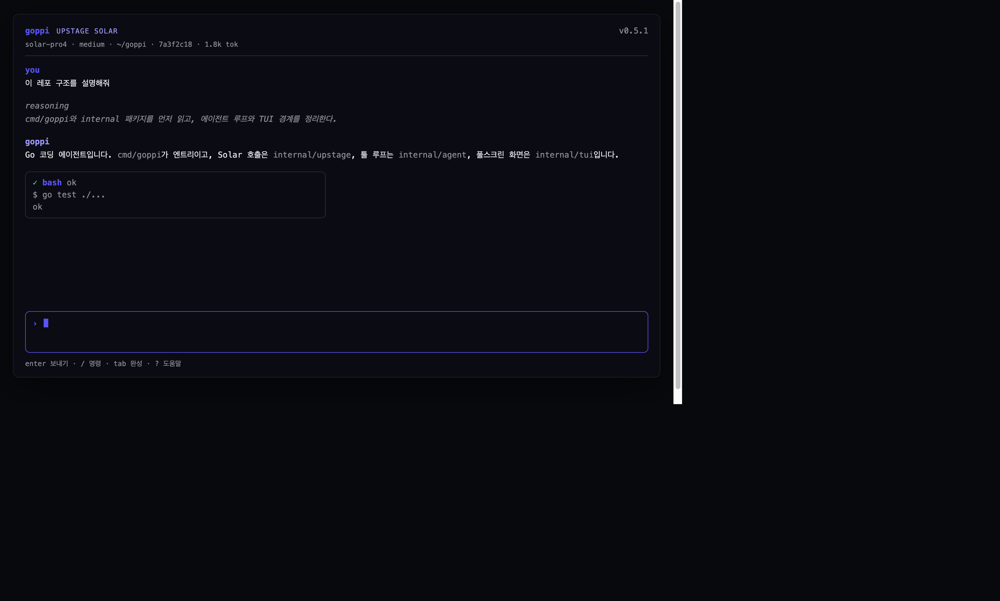

<div align="center">


<h1>goppi (고삐)</h1>

**goppi** is a terminal coding agent on
[Upstage Solar](https://console.upstage.ai/docs/capabilities/generate).
It runs as a fullscreen TUI that reads your tree, edits files, runs the
shell, and parses office documents — interactively, or headlessly for
scripts and CI.

[Installing](#installing) ·
[Building from source](#building-from-source) ·
[Documentation](#documentation) ·
[Repository layout](#repository-layout) ·
[Development](#development) ·
[License](#license)



Default model is `solar-pro4` with `reasoning_effort=medium`.
Get a key at [console.upstage.ai](https://console.upstage.ai).

</div>

---

## Installing

Requires [Go 1.27+](https://go.dev/dl/). The installer is `go install`:

```bash
curl -fsSL https://raw.githubusercontent.com/sspzoa/goppi/main/install.sh | bash
goppi version
goppi login
goppi
```

Or, if `$(go env GOPATH)/bin` is already on `PATH`:

```bash
go install github.com/sspzoa/goppi/cmd/goppi@latest
```

`goppi login` writes `~/.config/goppi/credentials.json` (`0600`). It is a
local key store — not OAuth, and it does not open a browser. You can also
export `UPSTAGE_API_KEY`. See [Authentication](docs/user-guide/authentication.md).

## Building from source

```bash
git clone https://github.com/sspzoa/goppi.git
cd goppi
make build          # bin/goppi
make test
./bin/goppi version
```

`make install` is `go install ./cmd/goppi`.

On first launch, `cd` into a project and run `goppi`. Useful first prompts:

```text
이 레포 구조를 설명해줘
테스트가 어디서 도는지 찾고 한 개만 돌려
```

Headless:

```bash
goppi -p "이 레포 구조를 설명해줘"
goppi -p "요약해" --output-format json
goppi --always-approve -p "go test ./..."
```

`bash`, `write_file`, and `edit_file` ask before running unless
`--always-approve` / `--yolo`. JSON and non-TTY deny those tools unless
you pass the flag.

## Documentation

The user guide ships in [`docs/`](docs/README.md):

| Page | Contents |
|------|----------|
| [Getting started](docs/user-guide/getting-started.md) | Install, API key, first TUI session |
| [Authentication](docs/user-guide/authentication.md) | `login` / `logout`, env vars |
| [TUI](docs/user-guide/tui.md) | Keys, slash commands, overlays |
| [CLI](docs/user-guide/cli.md) | Commands, flags, shell completions |
| [Configuration](docs/user-guide/configuration.md) | Files, models, `GOPPI.md` |
| [Sessions](docs/user-guide/sessions.md) | `-c` / `-r`, export |
| [Tools](docs/user-guide/tools.md) | Files, bash, Document Parse / OCR |
| [Headless](docs/user-guide/headless.md) | `-p`, JSON, CI |
| [Development](docs/development.md) | Build, tests, package layout |

Shell completions:

```bash
goppi completions zsh  > ~/.zfunc/_goppi
goppi completions bash > /usr/local/etc/bash_completion.d/goppi
goppi completions fish > ~/.config/fish/completions/goppi.fish
```

Inside the TUI, `/` then `tab` completes `/model`, `/effort`, and their values.

## Repository layout

| Path | Contents |
|------|----------|
| `cmd/goppi` | CLI entry: run, login, doctor, sessions, completions |
| `internal/upstage` | Solar Chat + Document Parse / OCR HTTP |
| `internal/provider` | Chat request/response, SSE |
| `internal/agent` | Tool loop and event sink |
| `internal/tui` | Fullscreen chat (Charm Bubble Tea v2) |
| `internal/repl` | TTY → TUI, else line loop; headless `-p` |
| `internal/tools` | Files, bash, documents |
| `internal/session` | Named transcripts |
| `internal/instructions` | `GOPPI.md` / `AGENTS.md` |
| `internal/complete` | Slash + shell autocomplete |
| `internal/config` | Defaults, env, credentials |

Agent, tools, and the Upstage client stay in the standard library. The
interactive TUI is Charm. `GOPPI_TUI=0` falls back to the line REPL.

## Development

```bash
make build
make test
go vet ./...
./bin/goppi
```

CI (`.github/workflows/ci.yml`) runs tests, `go build`, `goppi version`,
and `goppi help` on Go 1.27.

Project instructions the agent reads, in order: `GOPPI.md`, `AGENTS.md`,
`.goppi/instructions.md`. `goppi init` writes a stub.

See [CHANGELOG.md](CHANGELOG.md) for what landed in each release.

## License

[AGPL-3.0](LICENSE).
